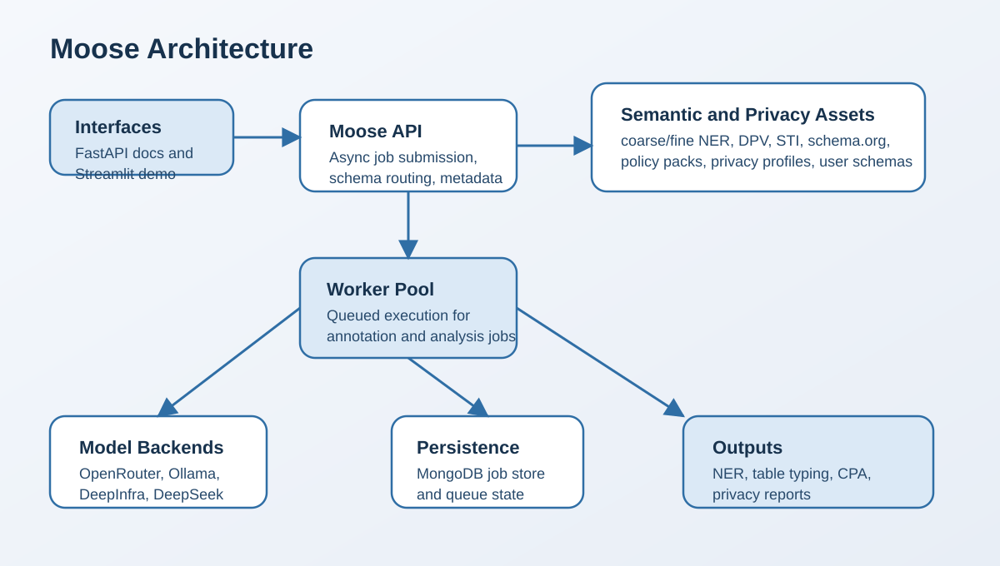
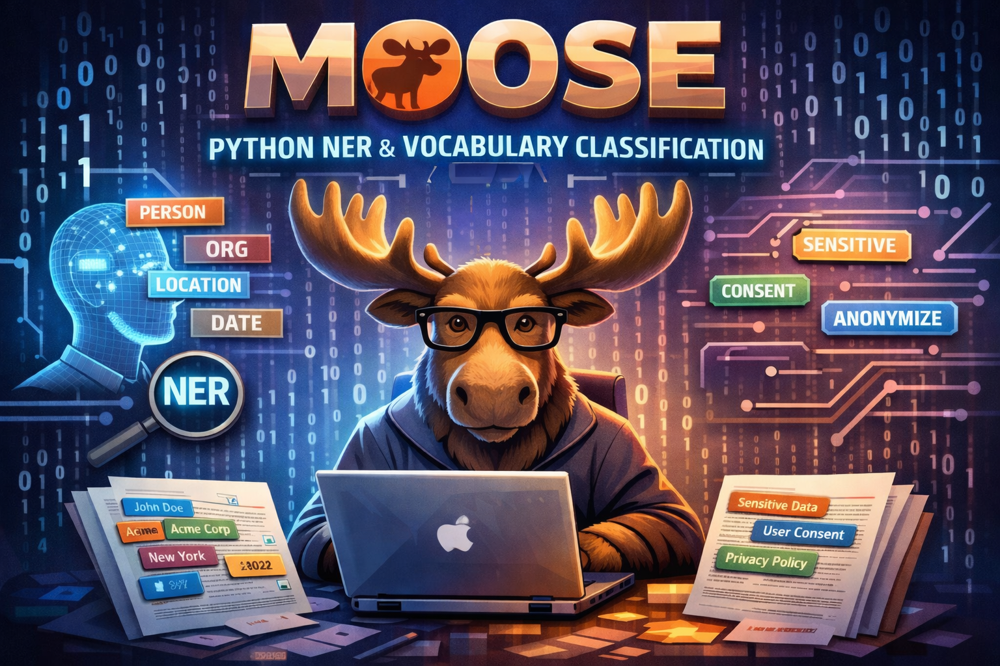

  <h1>Moose</h1>
  

## **General Description**
Moose is a Python-based async API and Streamlit demo that uses large language models (LLMs) to perform ontology-aware text annotation, tabular semantic typing, schema ingestion, and privacy analysis. It supports semantic targets such as coarse and fine NER types, DPV / DPV-AI, STI, and curated schema.org vocabularies, and can be used for dataset enrichment, schema onboarding, and compliance-oriented analysis within DATAPACT workflows.

## **Related Compliance aspects**

- Data/AI pipeline step implementation for semantic enrichment and privacy-aware analysis

## **Main Goal/Functionalities**
- LLM-assisted text annotation, tabular typing, and column-property prediction
- Multi-ontology support across NER-derived schemas, DPV / DPV-AI, STI, and schema.org subsets
- Outputs suitable for dataset enrichment, schema onboarding, and privacy-report generation

## **Architecture**

## **Component Definition**
Moose is a modular service that accepts text and tabular inputs, resolves the requested schema or vocabulary, and runs async jobs through FastAPI-backed workers using configurable LLM providers. It integrates bundled ontologies, policy packs, privacy profiles, and user-ingested schemas to produce annotation outputs, column-typing predictions, schema-ingest artifacts, and machine-readable privacy reports for downstream processing.

## **Screenshots**

## **Commercial Information**

| Organisation (s) | License Nature | License |
|------------------|----------------|---------|
| SINTEF | Open Source | Apache License 2.0 |

## **Expected KPIs**

| What (types) | How (Process) | Values |
|--------------|----------------|--------|
| **Multi-Ontology & Entity Type Support** | Demonstrated entity linking experiments using different ontology or semantic schemas. Validation includes configurable ontology selection and output aligned with ontology identifiers (e.g., URI, QID). | Support for at least 3 semantic targets such as: **schema.org** (general semantic vocabulary), **DPV / DPV-AI** (privacy and AI domain ontology), and **NER-derived type schema** with both coarse categories (e.g., Person, Organization, Location) and fine-grained entity types |

## **Related Project Links**
| Project Links |
| ------------- |
| Software GitHub Repository (Moose) <https://github.com/DATAPACT/moose> |

## **How To Install**
Moose is available in this repository. For the current installation steps, use the root README: [../README.md](../README.md).

### Detailed steps

n/a

## **How To Use**
For current setup and usage patterns, see the root README: [../README.md](../README.md).

## **Other Information**

Moose includes bundled semantic, legal, and policy assets under `src/moose/data` together with sample schema-ingest payloads under `examples/schema_ingest_samples`.

## **OpenAPI Specification**

Available from the running service at `http://localhost:8000/openapi.json`.

## **Additional Links**

| Additional Links |
| ------------- |
| Root project README [../README.md](../README.md) |
| Schema ingest samples [../examples/schema_ingest_samples/README.md](../examples/schema_ingest_samples/README.md) |
